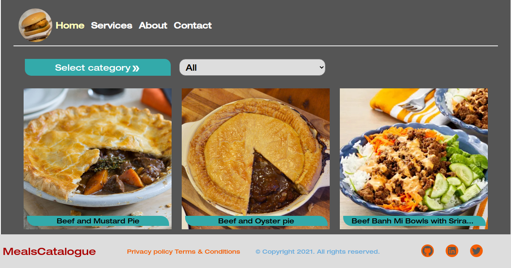

# Meals Catalogue - React-Redux Capstone Project



> In this project, I built a website a user can browse catalogue of meals. The app makes an external API request to retrieve a list of categories of meals as well as a list of meals in each category. The retrived API data is stored in the ```redux store``` and served the user according to some selected filters.

> ```React-Redux Hooks``` was used to fetch the requested data from the ```redux store```. 

> ```axios``` package was used for external API call.

> In order to allow an ```async action creator``` function to be returned on ```dispatch```, instead of the action itself, ```redux-thunk``` package was used alongside ```axios```.

> The app was successfully tested and deployed on heroku.

### Languages, Frameworks, Metthods

- JavaScript
- ReactJS
- React-Redux
- React-Redux Hooks

### Test Frameworks

- React Testing Library
- react-test-renderer
- Jest


## 📝 Setup

 - Open a terminal
 
 - Clone this app: 
        ```
        git clone https://github.com/ezeilo-su/meals-catalogue
        ```

- ```cd``` into the app directory.

- Run the command ```npm install``` to install the app dependencies.

- In the project directory, run:

#### `npm start`

Runs the app in the development mode.\
Open [http://localhost:3000](http://localhost:3000) to view it in the browser.

The page will reload if you make edits.\
You will also see any lint errors in the console.

### `npm test`

Launches the test runner in the interactive watch mode.

### Check out live demo [here](https://mealscatalogue.herokuapp.com/)


## Author

👤 **Sunday Uche Ezeilo**

- Github: [@sundayezeilo](https://github.com/ezeilo-su)
- Twitter: [@SundayEzeilo](https://twitter.com/SundayEzeilo)
- Linkedin: [Sunday Ezeilo](https://www.linkedin.com/in/sundayezeilo/)


## 🤝 Contributing

- Contributions, issues, and feature requests are welcome!

- Feel free to check the [issues page](https://github.com/ezeilo-su/meals-catalogue/issues).

## Show your support

Give a ⭐️ if you like this project!


## Acknowledgments

- Microverse
- @ebukaume
- etc

## Credit
- Design idea by [Denys Chagaida on Behance](https://www.behance.net/chagaida).

## 📝 License

This project is MIT-licensed.